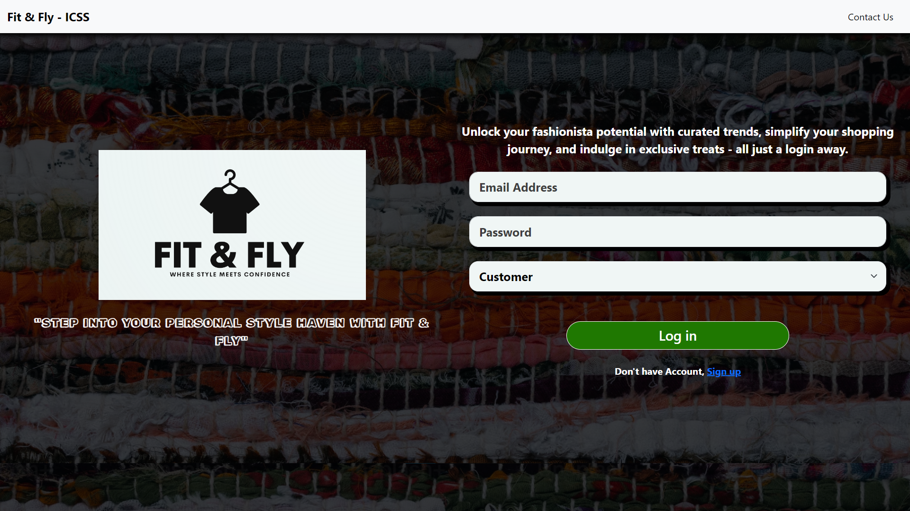

# Fit & Fly - Integrated Customer and Sales Management System

Fit & Fly is a comprehensive Integrated Customer and Sales Management System designed to streamline operations and enhance customer experience. The system caters to three primary user roles: Customers, Employees, and Admins. Customers can seamlessly browse, purchase, and manage their orders, while Employees handle order approvals, inventory management, and report generation. Admins oversee the entire platform, managing users, products, categories, and system settings.Also Customers will receive the Email for their Orders Placed and Transaction Done Successfully.

## Technologies Used

- HTML
- CSS
- Javascript
- Bootstrap
- React
- Node
- Express
- Mongo
- MERN

## Getting Started

This section explains how to set up your project locally for development.

### Prerequisites

Make sure you have the following installed on your local machine:

- **Node.js**: [Download and install](https://nodejs.org/)
- **npm** or **yarn**: Comes bundled with Node.js.

### Installation

To install the project, follow these steps:

1. **Clone the repository:**

   ```bash
   git clone https://github.com/debugger-snjy/Fit-And-Fly-Frontend
   ```

2. **Installing the Node Packages:**

   ```bash
   npm install
   ```

3. **Running the Application:**

   ```bash
   npm start
   ```

4. **Running the Backend Project:**
   Also, As we have a different [Backend Project](https://github.com/debugger-snjy/Fit-And-Fly-Backend), then we will download, install, and run the Backend Project like we have run this project

## Screenshots

Login Page:


